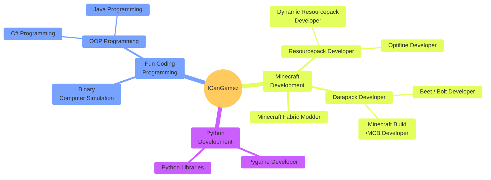

# Hello!

Im *ICanGamez* and I create datapacks for minecraft java edition, python projects, and a mixture of the two together. I am most known for my dungeon runner datapack and other rpg related code projects, currently working on .bolt files and learning to create python librarys for minecraft. If ya need help with anything datapacks or minecraft related, let me know because I can help you a lot!

You know its fun when you created a graph about what you can do, so here is mine!

